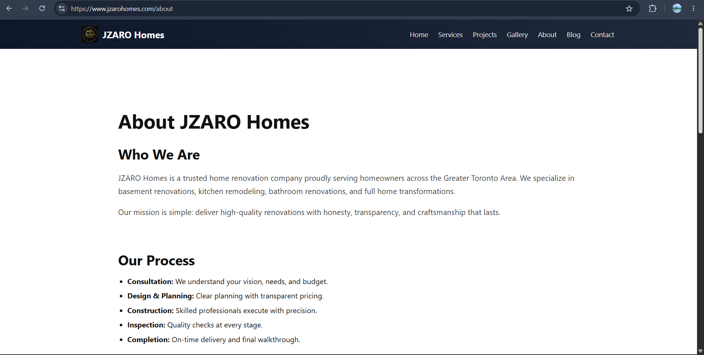
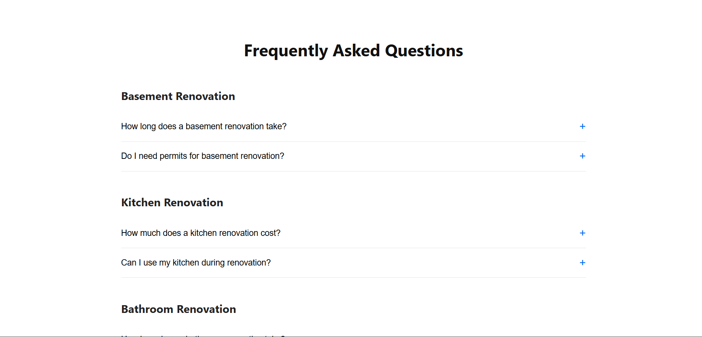
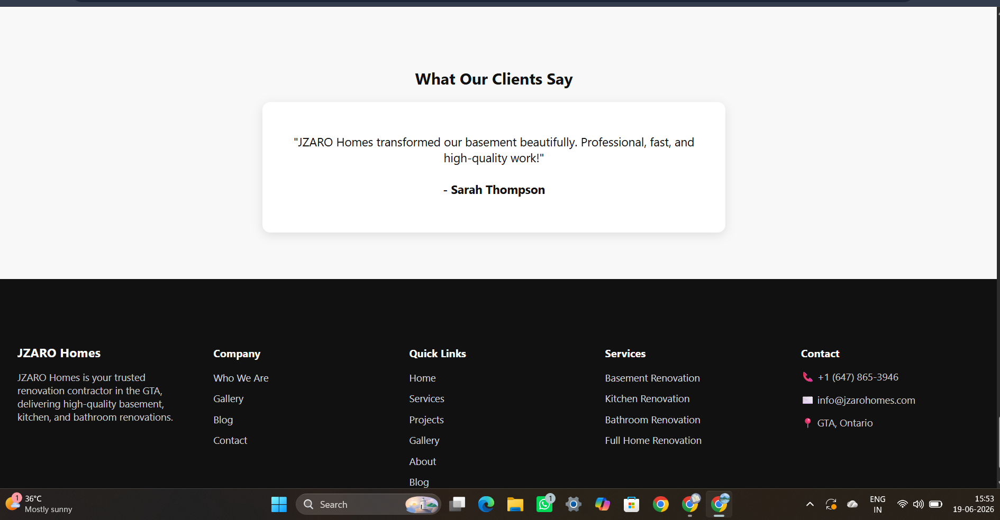
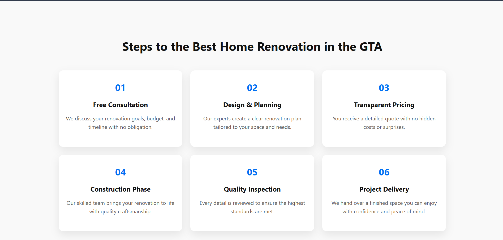

# JZARO Homes

Modern home renovation website built with Next.js, responsive UI, SEO optimization, and conversion-focused design.

## Overview

JZARO Homes is a modern home renovation and remodeling website designed to help homeowners explore renovation services, view completed projects, and connect with renovation experts.

The platform focuses on user experience, responsive design, SEO optimization, and lead generation.

## Features

- Responsive Design
- Modern UI/UX
- SEO Optimization
- Service Showcase
- Project Gallery
- Contact Form
- Mobile Friendly Layout

## Tech Stack

- Next.js
- React.js
- JavaScript
- CSS Modules
- Vercel

## Project Screenshots

### Home Page

### About Page

### FAQ Section

### Client Reviews

### Demo Section

### Information Section

## Live Demo

## Live Website

https://jzarohomes.com

## GitHub Repository

https://github.com/Syed-SS/jzaro-homes
